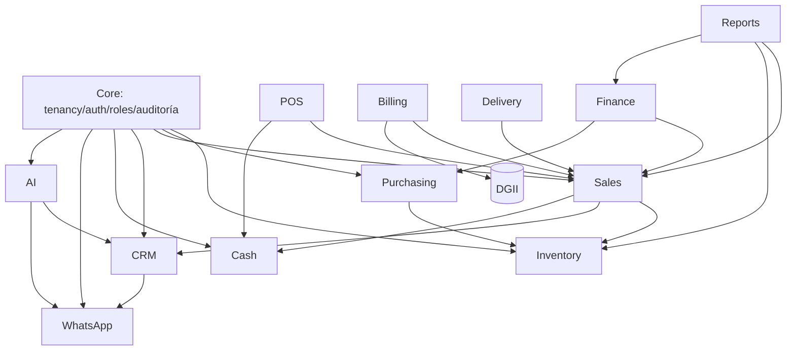

# MASTER_PLAN.md — BM Business OS

> **Documento maestro de arquitectura.** Fuente de verdad del proyecto. Todo el código y las
> decisiones técnicas deben ser consistentes con este documento. Complementa a `CLAUDE.md`
> (que define la filosofía y las reglas) con el diseño técnico ejecutable.

**Estado:** Fases 0–9 completadas. Pendiente: aplicación de los límites de plan
(`max_users` / `max_branches`, ver §5.1). La lectura por cámara (§5.3) está implementada; para
usarla desde el móvil en tienda hace falta servir por HTTPS (decisión de despliegue).
**Rol del autor:** Arquitecto Principal / Tech Lead.
**Fecha:** 2026-07-09 (última actualización: 2026-07-16).

## Decisiones estratégicas confirmadas

Antes de las 14 secciones, se fijan las tres decisiones que gobiernan toda la arquitectura:

| # | Decisión | Elección | Justificación |
|---|----------|----------|---------------|
| 1 | **Rol de Supabase** | **Solo PostgreSQL gestionado.** Laravel maneja auth, storage y realtime. | Evita el "split-brain" de autenticación (dos fuentes de identidad). Laravel + Sanctum/Fortify da control total sobre sesiones, 2FA, roles y policies. Supabase aporta un Postgres gestionado, con backups y `pgvector` para IA, sin acoplar la lógica de negocio a un BaaS propietario. |
| 2 | **Frontend / clientes** | **Solo Web:** Blade + Livewire + Tailwind + Alpine.js. | Un solo stack acelera el time-to-market y reduce superficie de mantenimiento. La API REST versionada se diseña desde el día uno para habilitar móvil/PWA a futuro sin reescribir el dominio. |
| 3 | **Primera fase de código** | **Fundación (core):** multiempresa, `company_id`, auth, roles/permisos, auditoría. | Ningún módulo de negocio es seguro ni multiempresa sin esta base. Construirla primero previene fugas de datos entre empresas (el riesgo #1 de un SaaS multi-tenant). |

---

## 1. Visión general del sistema

**BM Business OS** es un **Business Operating System** modular y multiempresa: no un simple
POS, sino una plataforma capaz de administrar íntegramente un negocio (ventas, inventario,
compras, caja, facturación, CRM, delivery, finanzas, RRHH) y **superar a soluciones como
Zimple POS** mediante automatización (n8n), mensajería (WhatsApp/Evolution API) e inteligencia
artificial (OpenAI/Claude + RAG).

**Principios rectores:**
- **Multiempresa nativo:** toda entidad de negocio está aislada por `company_id`.
- **Modular:** cada dominio es un módulo con límites claros; se pueden activar/desactivar por empresa.
- **Orientado a eventos:** las acciones importantes emiten eventos que disparan automatizaciones.
- **API-first:** el dominio es agnóstico del canal (web hoy, móvil mañana).
- **Producción desde el día uno:** seguridad, auditoría, testing y observabilidad no son opcionales.

**Propuesta de valor diferencial:** automatización end-to-end. Ejemplo de una venta:
`Venta → descontar inventario → notificar WhatsApp → generar factura DGII → actualizar CRM → registrar auditoría`,
todo orquestable con n8n sin tocar el core.

---

## 2. Arquitectura propuesta

**Estilo:** **Monolito modular** en Laravel 12 con límites de módulo estrictos (DDD ligero).
Se elige monolito modular sobre microservicios porque:
- El equipo y el producto están en fase temprana: los microservicios añaden costo operativo
  (despliegue, red, consistencia distribuida) sin beneficio todavía.
- Los límites de módulo bien definidos permiten **extraer** un módulo a servicio propio más
  adelante si escala lo exige, sin rehacer el dominio.

**Capas y flujo de una petición (regla de oro: cero lógica de negocio en Controllers):**

```
HTTP Request
   │
   ▼
Route  ──►  Middleware (auth, tenant scope, permission, rate limit)
   │
   ▼
Controller  ──►  Form Request (validación + autorización)
   │
   ▼
Service (lógica de negocio, transacciones, orquestación)
   │
   ├──►  Repository  ──►  Eloquent Model  ──►  PostgreSQL
   │
   └──►  dispatch(Event)
              │
              ▼
        Listener / Job (cola)  ──►  n8n / WhatsApp / IA / Auditoría
```

**Patrones aplicados (SOLID + DDD):**
- **Service Layer:** toda la lógica de negocio; único lugar que abre transacciones.
- **Repository Pattern:** abstrae el acceso a datos; los Services no conocen Eloquent directamente.
- **DTOs:** transporte de datos tipado entre capas (entrada de Services, salida de API).
- **Form Requests:** validación + autorización declarativa antes del Controller.
- **Events / Listeners:** desacoplan efectos secundarios (inventario, notificaciones, auditoría).
- **Queues / Jobs:** trabajo pesado o de integración fuera del ciclo request (Redis + Horizon).
- **Policies:** autorización por recurso, siempre validando también el `company_id`.

**Responsabilidad de cada capa:**
- Controller: traduce HTTP ↔ Service. Delgado.
- FormRequest: valida forma y permisos.
- Service: reglas de negocio, invariantes, transacciones, emite eventos.
- Repository: consultas y persistencia.
- Model: relaciones, casts, scopes (incluido el Global Scope de tenant).

---

## 3. Tecnologías utilizadas

| Capa | Tecnología | Notas |
|------|-----------|-------|
| Lenguaje | PHP 8.4 | Tipado estricto, enums, readonly props para DTOs. |
| Framework | Laravel 12 | Base del monolito modular. |
| Base de datos | PostgreSQL (Supabase gestionado) | Normalizada, multiempresa, `pgvector` para IA. |
| Cache / colas | Redis + Laravel Horizon | Cache, sesiones, colas, rate limiting. |
| Contenedores | Docker + docker-compose | php-fpm, nginx, postgres (local), redis, n8n. |
| Frontend | Blade + Livewire 3 + Tailwind CSS + Alpine.js | SPA-like sin construir una SPA separada. |
| Auth | Laravel Sanctum + Fortify | Sesiones web + tokens API + 2FA. |
| Autorización | spatie/laravel-permission | Roles y permisos por empresa. |
| Auditoría | owen-it/laravel-auditing | Registro de cambios por modelo. |
| Storage | Cloudflare R2 (S3-compatible) | Archivos, imágenes, documentos. |
| Testing | Pest (unit + feature) | Cobertura de Services, Policies, API. |
| Calidad | Laravel Pint (PSR-12) + Larastan (PHPStan) | Formato y análisis estático. |
| Automatización | n8n | Orquestación de flujos vía webhooks/API. |
| Mensajería | Evolution API + WhatsApp Business | Envío/recepción de mensajes. |
| IA | OpenAI + Claude (abstracción de proveedor) | Chat, clasificación, embeddings, RAG. |
| Fiscal | Integración DGII (República Dominicana) | Facturación fiscal / e-CF. |

---

## 4. Estructura de carpetas

Se adopta una **estructura modular** dentro de `app/Modules/`, en lugar de la estructura plana
por defecto de Laravel. Justificación: con 13+ módulos, la estructura plana
(`app/Models`, `app/Services` con todo mezclado) se vuelve inmanejable y difumina los límites
de dominio. Agrupar por módulo hace los límites explícitos y facilita una futura extracción.

```
app/
├── Modules/
│   ├── Core/            # Empresas, sucursales, almacenes, usuarios, tenancy, auditoría
│   ├── Inventory/       # Productos, categorías, stock, movimientos, almacenes
│   ├── Purchasing/      # Proveedores, órdenes de compra, recepciones
│   ├── Sales/           # Cotizaciones, pedidos, ventas
│   ├── POS/             # Terminal de punto de venta, sesiones
│   ├── Cash/            # Caja, aperturas/cierres, arqueos
│   ├── Billing/         # Facturación, DGII / e-CF
│   ├── CRM/             # Clientes, contactos, pipeline, oportunidades
│   ├── WhatsApp/        # Evolution API, conversaciones, plantillas
│   ├── AI/              # OpenAI/Claude, RAG, embeddings, sentimiento
│   ├── Delivery/        # Repartos, rutas, seguimiento
│   ├── Finance/         # Cuentas, movimientos, reportes financieros
│   ├── HR/              # Empleados, portal del empleado
│   └── Reports/         # Dashboard ejecutivo, reportes cruzados
│
│   Cada módulo sigue esta sub-estructura:
│   └── {Módulo}/
│       ├── Models/
│       ├── Services/
│       ├── Repositories/       (Contracts/ + implementaciones)
│       ├── DTOs/
│       ├── Http/               (Controllers/, Requests/, Resources/, Livewire/)
│       ├── Events/
│       ├── Listeners/
│       ├── Jobs/
│       ├── Policies/
│       ├── Providers/          (ServiceProvider del módulo)
│       └── routes/             (web.php, api.php del módulo)
│
├── Support/             # Código transversal (traits, helpers, base classes)
database/
├── migrations/          # Por módulo o con prefijo de módulo
└── seeders/
tests/
├── Unit/
└── Feature/
docker/                  # Dockerfiles y config de nginx/php
```

Cada módulo registra su `ServiceProvider` (bindings de repositorios, rutas, eventos), lo que
mantiene el acoplamiento explícito y controlado.

---

## 5. Módulos del sistema

| Módulo | Objetivo | Responsabilidad | Entidades clave |
|--------|----------|-----------------|-----------------|
| **Core** | Base multiempresa, seguridad y plataforma | Tenancy, usuarios, roles/permisos, auditoría, planes y suscripciones | `companies`, `branches`, `warehouses`, `users`, `roles`, `permissions`, `audits`, `plans`, `subscriptions` |
| **Inventory** | Control de stock | Catálogo, existencias, movimientos por almacén | `products`, `categories`, `stock`, `stock_movements` |
| **Purchasing** | Abastecimiento | Proveedores y órdenes de compra | `suppliers`, `purchase_orders`, `purchase_receipts` |
| **Sales** | Ventas | Cotizaciones, pedidos, ventas | `quotes`, `orders`, `sales`, `sale_items` |
| **POS** | Punto de venta | Terminal, sesiones de venta rápida | `pos_sessions`, `pos_terminals` |
| **Cash** | Caja | Aperturas, cierres, arqueos, movimientos | `cash_registers`, `cash_sessions`, `cash_movements` |
| **Billing** | Facturación fiscal | Facturas, e-CF, integración DGII | `invoices`, `invoice_items`, `fiscal_sequences` |
| **CRM** | Relación con clientes | Clientes, contactos, pipeline | `customers`, `contacts`, `opportunities`, `pipelines` |
| **WhatsApp** | Mensajería | Conversaciones, plantillas, Evolution API | `wa_conversations`, `wa_messages`, `wa_templates` |
| **AI** | Inteligencia artificial | RAG, embeddings, sentimiento, asistentes | `ai_documents`, `ai_embeddings`, `ai_conversations` |
| **Delivery** | Reparto | Rutas, entregas, seguimiento | `deliveries`, `routes`, `delivery_tracking` |
| **Finance** | Finanzas | Cuentas, movimientos, reportes | `accounts`, `financial_movements` |
| **HR** | Recursos humanos | Empleados, portal del empleado | `employees`, `attendances` |
| **Reports** | Analítica | Dashboard ejecutivo, reportes cruzados | (lecturas agregadas / vistas) |

---

## 5.1 Capa de plataforma (SaaS): planes y suscripciones

El sistema se comercializa como SaaS: el **operador de la plataforma** (super administrador) vende
planes a empresas. Esta capa vive dentro de **Core** —no es un módulo de negocio— porque gobierna
el acceso de las empresas al resto del sistema y ninguna empresa es dueña de ella.

**Decisión: cobro manual, sin pasarela de pago.** El operador registra los pagos desde el panel de
plataforma. Justificación: la facturación real (transferencia, efectivo) es el canal habitual en el
mercado objetivo, e integrar una pasarela añadiría dependencia externa, webhooks y conciliación sin
resolver todavía un problema real. `SubscriptionService` concentra el ciclo de vida, de modo que
integrar una pasarela más adelante consiste en llamar a `registerPayment()` desde un webhook.

**Entidades:**

| Tabla | Rol | Notas |
|-------|-----|-------|
| `plans` | Catálogo comercial de la plataforma. | Sin `company_id`: no pertenece a ninguna empresa. `modules` = JSON con las claves incluidas (`null` = todos). `price`, `billing_cycle`, `trial_days`, `max_users`, `max_branches`. |
| `subscriptions` | Suscripción vigente de una empresa (una por empresa). | Se muta en el tiempo (no es un historial). `status`, `trial_ends_at`, `current_period_start/end`, `cancelled_at`. |

**Ciclo de vida** (`Core\Services\SubscriptionService`): `subscribe()` (con prueba si el plan la
ofrece, si no activa con el primer período por pagar) → `registerPayment()` (activa y extiende un
ciclo, encadenando al final del período vigente para no perder tiempo pagado) → `changePlan()`,
`suspend()`, `cancel()`. Los estados viven en el enum `SubscriptionStatus`.

**Doble puerta de acceso** (dos middlewares con responsabilidades distintas, no redundantes):

- `subscription` (`EnsureSubscriptionActive`): **¿puede operar la empresa?** Bloquea si la empresa
  fue suspendida por el operador (`is_active = false`) o si su suscripción no está al día (vencida,
  suspendida o cancelada) y redirige a `panel.suspended`. El super admin lo atraviesa; las empresas
  sin suscripción (heredadas) pasan.
- `module:{clave}` (`EnsureModuleActive`): **¿incluye su plan este módulo?** El acceso sale del
  plan de la suscripción; si no hay suscripción, de la columna `modules` de la empresa. El catálogo
  de módulos comercializables es `Core\Support\ModuleRegistry` (dashboard, reportes y usuarios son
  núcleo y no se venden por separado).

Las rutas que deben seguir siendo accesibles con la cuenta vencida (`panel.account`,
`panel.suspended`, portal del empleado) quedan **fuera** del middleware `subscription`: si no, el
usuario no podría ni consultar su estado para regularizar.

**Cobertura:** `tests/Feature/Core/SubscriptionTest.php` — ciclo de vida, gating por módulos del
plan, bloqueo por suspensión, acceso heredado, y que un dueño no pueda gestionar planes.

**Deuda conocida:** `max_users` y `max_branches` se definen y validan en el formulario de planes
pero **no se aplican todavía** en el alta de usuarios ni de sucursales. Cerrarlo exige decidir el
comportamiento al superar el límite (bloquear vs. cobrar excedente) antes de escribir código.

---

## 5.2 Portal del cliente

Cierra el último pendiente de la Fase 7. El cliente consulta sus facturas, sus compras, sus
entregas y su ficha de contacto, en solo lectura.

**Prerrequisito resuelto: el enlace cliente ↔ documentos.** Las ventas, facturas y entregas solo
guardaban `customer_name` (texto libre): no había forma fiable de saber qué documentos eran de
quién. Se añadió `customer_id` (nullable) a las tres tablas. Nullable porque la venta de mostrador
del POS no identifica a nadie; el enlace es propio de cada tabla (en vez de derivarse de la venta)
porque facturas y entregas pueden existir sin ella. `customer_name` se conserva: es el nombre
histórico impreso en el documento y no debe cambiar si luego se corrige la ficha del CRM.

**Decisión: acceso por enlace firmado, sin contraseña.** El cliente no es un usuario del sistema.
En vez de crear un guard propio (login, recuperación de contraseña, otra credencial que el cliente
debe recordar), se le envía por WhatsApp —el canal que ya usa con el negocio— un enlace firmado y
temporal (`URL::temporarySignedRoute`, 7 días por defecto).

- La firma es un HMAC sobre la URL completa: manipular el id del cliente la invalida, así que no se
  puede saltar de un cliente a otro.
- Contrapartida aceptada: quien tenga el enlace, entra (como en un «restablecer contraseña»). Por
  eso el portal es de solo lectura y la caducidad es corta.

**Aislamiento (el punto delicado).** Al no haber sesión, el tenant **no puede** salir del usuario
autenticado: `CustomerPortalController` lo deriva del propio cliente que identifica el enlace y fija
`CurrentCompany` antes de cualquier consulta; de ahí en adelante aísla el `CompanyScope` de siempre.
La única consulta sin scope es la que resuelve al cliente (todavía no hay tenant: es él quien lo
determina), y es segura porque el id viaja dentro de una URL firmada. Por el mismo motivo no se usa
route model binding: si un usuario de otra empresa tuviera sesión abierta, su tenant activo haría
que ese cliente «no existiera» (404).

**Puertas.** El portal se apaga con un 403 y mensaje neutro si la empresa está suspendida o su
suscripción no está al día (el estado de pago de la empresa no es asunto de sus clientes). Cada
bloque aparece solo si la empresa tiene contratado su módulo (`billing`, `sales`, `delivery`).

**Ubicación.** El controlador vive a nivel de aplicación, no dentro de un módulo: es una lectura
transversal de CRM, Ventas, Facturación y Entregas, y alojarlo en CRM obligaría a ese módulo a
conocer los modelos de los otros tres (§6). Mismo criterio que `PanelController`. La generación y el
envío del enlace sí son de CRM (`CustomerPortalService`).

**Cobertura:** `tests/Feature/CRM/CustomerPortalTest.php` — firma, manipulación del id, caducidad,
aislamiento entre clientes y entre empresas, sesión ajena abierta, empresa suspendida, módulo no
contratado, propagación del cliente a factura y entrega, y envío del enlace.

---

## 5.3 Código de barras: escaneo en el POS y entrada de mercancía

**Decisión: no se creó un módulo de facturación de productos.** El POS ya es exactamente eso
(carrito → cobro → caja → factura con NCF); solo le faltaban el lector y un buscador. Un módulo
aparte habría duplicado carrito, cobro, caja y NCF, contra las reglas de dependencia de §6.

**El lector no necesita integración.** Un lector de pistola USB/Bluetooth se comporta como un
teclado: escribe el código en el campo enfocado y pulsa Enter. Por eso no hay driver, librería ni
permiso de navegador: solo un campo con el foco y `@keydown.enter`. Teclear el código a mano usa el
mismo camino. El campo va **fuera** del formulario de cobro: dentro, el Enter del lector enviaría la
venta a medio armar.

**`products.barcode`** existía desde la Fase 2 del roadmap con su índice, pero **nunca se escribía**
(no estaba en ninguna regla de validación, así que `validated()` la descartaba siempre). Se activó y
su índice pasó a ser **único por empresa**: escanear exige resolución determinista, o el cajero
cobraría el artículo equivocado. Único *compuesto* con `company_id`, porque dos empresas pueden
vender el mismo artículo de fábrica; los NULL no colisionan, así que los productos sin código
conviven. La regla de validación **no** usa `withoutTrashed()`, igual que la del SKU: el índice sí ve
las filas borradas en suave, e ignorarlas haría pasar la validación y reventar el INSERT.
*Deuda asumida*: borrar un producto quema su código (mismo comportamiento que el SKU).

**Resolución del código** (`Inventory\Support\ProductLookupPresenter`, compartido por el POS y el
inventario, para que ambos rindan la misma forma): **barcode exacto → si no, SKU exacto**. Exacto y
no aproximado: un escaneo es una identidad, no una búsqueda. El endpoint responde **200 siempre**,
también con `found:false`, para que el terminal distinga «no está en el catálogo» de «caducó la
sesión / no hay permiso / falló el servidor»: en caja esos casos no pueden verse igual. Un artículo
inactivo o agotado devuelve `sellable:false` con su motivo, no «no encontrado»: el cajero necesita
saber por qué.

**El precio lo sigue poniendo el servidor.** El precio del payload solo pinta el ticket; al cobrar,
`PosController::checkout` lo relee de la base e ignora lo que llegue del cliente (el carrito solo
transporta `id` y `qty`). El control de stock del front es comodidad; el guardián real sigue siendo
`StockService` dentro de la transacción.

### Entrada de mercancía

Cubre el agujero real que había: **hasta ahora el stock de un producto existente no se podía
modificar desde la interfaz** (solo existía el stock inicial al crearlo).

- **Entrada rápida** (`panel.stock.entry`, permiso `stock.adjust`): escanear/teclear → cantidad →
  suma al almacén. Sin servicio nuevo: `StockService::increase()` ya *es* el caso de uso, y añadir
  otro habría abierto **una segunda puerta al stock**. Usa `StockMovementType::Adjustment`, **no**
  `Purchase`: «compra» significa entrada respaldada por una orden, y tiparla así ensuciaría el kardex
  con movimientos huérfanos imposibles de conciliar. Un código desconocido ofrece darlo de alta con
  el código ya puesto, reutilizando `panel.products.store` (cero backend nuevo; el kardex lo anota
  como `Initial`, que es lo que es).
- **Órdenes de compra** (`panel.purchase-orders.store` / `.receive`): el dominio ya existía y estaba
  probado, pero **sin una sola ruta HTTP**; ahora se expone. Van bajo `/panel/compras/ordenes` y solo
  por POST: `/panel/compras` ya lo ocupan los proveedores, y un PUT chocaría con
  `PUT /panel/compras/{supplier}`. Crear (`purchases.manage`) y recibir (`purchases.receive`) son
  permisos distintos: comprometer dinero con un proveedor no es dar por buena la mercancía.
  *Riesgo cerrado*: `PurchaseOrderService::create` protege proveedor y almacén con `findOrFail`, pero
  **inserta las líneas sin validar el producto**; el `exists` acotado por `company_id` del Form
  Request es la única defensa contra sumar stock al producto de otra empresa.

**Reparto de permisos**: el rol `staff` (cajero) puede cobrar y consultar códigos, pero **no** dar
entrada (`stock.adjust`) ni crear/recibir órdenes. Es control interno: quien puede inflar existencias
puede tapar un faltante. Si un negocio quiere que su cajero reciba mercancía, se le concede
`stock.adjust` en `RoleProvisioner::ROLES` — nunca aflojando el `can:` de la ruta.

**Cobertura**: `tests/Feature/Inventory/BarcodeTest.php`, `StockEntryTest.php`,
`tests/Feature/POS/BarcodeScanTest.php`, `tests/Feature/Purchasing/PurchaseOrderEndpointTest.php` —
unicidad y nulos múltiples, aislamiento entre empresas en cada endpoint, agotado/inactivo, permisos
por rol, y que recibir dos veces no duplique la existencia.

### Lectura por cámara

Alternativa a la pistola, no sustituto: leer un código 1D con la cámara de un móvil es más lento y
falla más (enfoque, movimiento, luz). Rinde para inventariar a pie de estantería, no en la cola de
caja. Implementada con **ZXing** (`@zxing/browser`), cargada con `import()` dinámico solo al pulsar
«Usar cámara»: Vite la separa en su propio trozo (~118 KB gzip) que **no** entra en `app.js`, así que
quien escanea con pistola no lo descarga. El visor es un componente Alpine compartido
(`x-panel.camera-scanner`) que emite `codigo-escaneado` y alimenta el mismo `scan()` del POS y de la
entrada de mercancía: para el servidor no hay diferencia entre pistola, teclado o cámara.

**Requisito operativo**: `getUserMedia` exige contexto seguro, así que la cámara funciona en
`localhost` pero **no** desde un móvil por IP de LAN. El visor lo detecta y avisa con un mensaje
claro en vez de fallar en negro. Para usarla en tienda desde el móvil hay que servir por HTTPS
(cloudflared o TLS en `bmos_web`) — decisión de despliegue, no de código.

---

## 6. Dependencias entre módulos



**Reglas de dependencia:**
- **Core** no depende de nadie; todos dependen de Core.
- Un módulo se comunica con otro **a través de sus Services o de Eventos**, nunca accediendo
  directamente a las tablas/Models de otro módulo. Esto preserva los límites y facilita cambios.
- Las dependencias son acíclicas (un DAG); si aparece un ciclo, se resuelve con un evento.

---

## 7. Roadmap de desarrollo

| Fase | Nombre | Alcance | Estado |
|------|--------|---------|--------|
| **0** | Bootstrap | Docker (php-fpm, nginx, postgres, redis, n8n), Laravel 12, conexión a Supabase, Pint/Larastan/Pest, CI básico | ✅ Completada |
| **1** | **Fundación (core)** | Multiempresa, tenant scoping por `company_id`, usuarios, roles/permisos, 2FA, auditoría, layout base Livewire | ✅ Completada |
| **2** | Inventario + Compras | Catálogo, stock por almacén, kardex de movimientos, proveedores, órdenes de compra (recepción → stock) | ✅ Completada |
| **3** | Ventas + POS + Caja | Ventas (descuentan stock), sesiones de caja con arqueo, checkout POS (venta + cobro) | ✅ Completada |
| **4** | Facturación (DGII) | Facturas con NCF (asignación atómica de secuencias fiscales), emisión desde venta | ✅ Completada |
| **5** | CRM + WhatsApp/Evolution | Clientes, pipeline/oportunidades, WhatsApp (gateway Evolution, envío/recepción, webhook firmado) | ✅ Completada |
| **6** | IA + RAG | Proveedor intercambiable (OpenAI/Claude/Local), RAG (embeddings JSON + coseno), clasificador de sentimientos por evento | ✅ Completada |
| **7** | Delivery / Finanzas / RRHH / Reportes + Portales | Entregas, finanzas (venta→ingreso), RRHH+asistencia, resumen ejecutivo en dashboard, portal del empleado y **portal del cliente** (§5.2) | ✅ Completada |
| **8** | **Plataforma SaaS** | Planes y suscripciones (cobro manual), gating de módulos por plan, suspensión de cuenta, panel del operador (§5.1) | ✅ Completada (límites `max_users`/`max_branches` sin aplicar) |
| **9** | **Código de barras y entrada de mercancía** | Escaneo en el POS (producto y precio al ticket), entrada rápida de stock por escaneo, órdenes de compra por HTTP y lectura por cámara (§5.3) | ✅ Completada (la cámara requiere HTTPS para usarse desde el móvil) |

**Regla operativa (de CLAUDE.md):** una fase debe quedar **completamente terminada**
(migraciones, modelos, servicios, repositorios, controladores, validaciones, API, interfaces,
permisos, eventos, automatizaciones, pruebas y documentación) antes de iniciar la siguiente.

---

## 8. Riesgos técnicos

| Riesgo | Impacto | Probabilidad | Mitigación |
|--------|---------|--------------|------------|
| **Fuga de datos entre empresas** (tenant leak) | Crítico | Media | Global Scope obligatorio por `company_id` + middleware de tenant + tests que verifican aislamiento en cada módulo. Nunca confiar en el `company_id` que llega del cliente. |
| **Acoplamiento entre módulos** | Alto | Media | Comunicación solo vía Services/Eventos; prohibido acceder a Models de otro módulo. Larastan + revisiones para detectar violaciones. |
| **Complejidad y costo de IA/RAG** | Medio | Alta | Capa de abstracción de proveedor, límites de tokens, cache de embeddings, control de costos por empresa. |
| **Límites de Evolution API / WhatsApp** (rate limits, bans) | Alto | Media | Colas con reintentos y backoff, respeto de rate limits, plantillas aprobadas, webhooks firmados. |
| **Cumplimiento DGII / e-CF** | Alto | Media | Módulo Billing aislado, secuencias fiscales transaccionales, entorno de pruebas DGII antes de producción. |
| **Dependencia de Supabase** | Medio | Baja | Se usa solo como Postgres estándar; sin features propietarias en el dominio → migrable a otro Postgres. Backups propios. |
| **Deuda técnica por velocidad** | Medio | Media | Fases cerradas con testing y documentación obligatorios; sin "code rápido" (regla de CLAUDE.md). |

---

## 9. Estrategias de escalabilidad

- **Colas y trabajo asíncrono:** Redis + Horizon para integraciones (WhatsApp, IA, n8n),
  reportes pesados y notificaciones. El request web permanece rápido.
- **Diseño stateless:** sesiones y cache en Redis → escalado horizontal de php-fpm detrás de nginx.
- **Base de datos:** índices por `company_id` + columnas de filtro frecuente; posibilidad de
  **particionar** tablas grandes (ventas, movimientos) por `company_id` o fecha; **read replicas**
  para reportes cuando el volumen lo exija.
- **Cache:** cache de consultas caras (catálogos, permisos, configuración de empresa) con
  invalidación por evento.
- **Modularidad:** un módulo con carga desproporcionada puede extraerse a su propio servicio
  gracias a los límites definidos, sin reescribir el dominio.
- **Observabilidad:** logs estructurados, métricas de colas (Horizon) y trazas para detectar
  cuellos de botella antes de escalar.

---

## 10. Estrategias de seguridad

- **Aislamiento multiempresa:** `BelongsToCompany` trait + **Global Scope** que filtra por
  `company_id` automáticamente + middleware que fija el tenant desde el usuario autenticado.
  Las Policies validan siempre pertenencia a la empresa.
- **Autenticación:** Laravel Fortify (login, registro, verificación) + Sanctum (sesión web y
  tokens API) + **2FA** (TOTP).
- **Autorización:** spatie/laravel-permission con roles y permisos por empresa; Policies por
  recurso; Form Requests con `authorize()`.
- **Auditoría:** owen-it/laravel-auditing registra quién, qué y cuándo por modelo sensible.
- **Rate limiting:** por usuario/IP en login, API y webhooks.
- **Protección web:** CSRF en formularios, sanitización, validación estricta vía Form Requests,
  cabeceras de seguridad.
- **Webhooks entrantes** (Evolution/n8n): verificación de firma/secreto y validación de origen.
- **Secretos:** en `.env` (dev) y en un gestor de secretos/variables de entorno del proveedor
  (prod); nunca en el repositorio.

---

## 11. Convenciones de desarrollo

- **Estilo de código:** PSR-12, formateado con **Laravel Pint**. Análisis estático con
  **Larastan (PHPStan)** en nivel alto; el pipeline falla si no pasa.
- **Nomenclatura:** Modelos en singular (`Product`), tablas en plural snake_case (`products`),
  Services `ProductService`, Repositorios con contrato `ProductRepositoryInterface` +
  implementación `EloquentProductRepository`, DTOs `CreateProductData`, Eventos en pasado
  (`SaleCompleted`), Jobs en imperativo (`SendWhatsAppMessage`).
- **Reglas de arquitectura:** cero lógica de negocio en Controllers; Services abren transacciones;
  no acceder a Models de otro módulo.
- **Testing (Pest):** unit para Services y reglas de negocio; feature para endpoints, Livewire,
  Policies y **aislamiento multiempresa**. Toda fase entrega pruebas.
- **Commits:** Conventional Commits (`feat:`, `fix:`, `refactor:`, `test:`, `docs:`).
- **API:** versionada (`/api/v1`), respuestas con API Resources, documentada (OpenAPI).
- **Documentación:** cada módulo con su README/objetivo; este MASTER_PLAN se mantiene actualizado.

---

## 12. Estrategia de integraciones (n8n, Supabase, Evolution API)

**n8n (automatización):**
- **Salida:** Laravel emite eventos de dominio; Listeners/Jobs publican **webhooks salientes**
  a n8n (payload firmado, con `company_id` e idempotencia).
- **Entrada:** n8n consume la **API REST v1** de Laravel para ejecutar acciones (crear venta,
  enviar mensaje, actualizar CRM). Autenticación por token de servicio con permisos acotados.
- Ejemplo: `SaleCompleted → webhook n8n → flujo: notificar WhatsApp + generar factura + CRM`.

**Supabase (PostgreSQL gestionado):**
- Conexión estándar de Laravel a Postgres (host/credenciales de Supabase). Sin SDK propietario
  en el dominio.
- Extensión **`pgvector`** habilitada para embeddings del módulo AI.
- Backups y monitoreo del propio Supabase, complementados con backups lógicos propios.

**Evolution API (WhatsApp):**
- **Cliente HTTP** dedicado en el módulo WhatsApp, con envío vía **Jobs en cola** (reintentos +
  backoff, respeto de rate limits).
- **Webhooks entrantes** (mensajes recibidos, estados) → endpoint firmado → evento de dominio
  → Listeners (CRM, IA de sentimiento, respuestas automáticas).
- Plantillas gestionadas y aprobadas; conversaciones persistidas para trazabilidad.

---

## 13. Plan para IA y RAG

**Objetivo:** asistentes con contexto del negocio, clasificación de sentimientos y respuestas
inteligentes en WhatsApp/CRM, sobre datos aislados por empresa.

- **Almacén vectorial:** `pgvector` en Postgres (`ai_documents`, `ai_embeddings`), con
  `company_id` para aislar el conocimiento por empresa.
- **Pipeline de ingesta (RAG):** documento/fuente → chunking → embeddings (Job en cola) →
  almacenamiento vectorial.
- **Recuperación:** consulta → embedding → búsqueda por similitud (filtrada por `company_id`) →
  construcción de prompt con contexto → respuesta del LLM.
- **Abstracción de proveedor:** interfaz `AiProvider` con implementaciones OpenAI y Claude
  intercambiables por configuración; el dominio no depende de un proveedor concreto.
- **Clasificador de sentimientos:** sobre mensajes entrantes de WhatsApp/CRM para priorizar y
  automatizar respuestas.
- **Control de costos y seguridad:** límites de tokens y de gasto por empresa, cache de
  embeddings, logging de uso, y nunca enviar datos de una empresa al contexto de otra.

---

## 14. Cronograma sugerido de implementación

> Estimaciones orientativas para un ritmo de desarrollo enfocado; se ajustan según el equipo.
> El principio de CLAUDE.md manda: **calidad y fase cerrada por encima de velocidad.**

| Fase | Módulos | Estimación | Hito |
|------|---------|------------|------|
| 0 | Bootstrap / infraestructura | ~1 semana | Entorno Docker + Laravel corriendo contra Supabase, CI verde |
| 1 | **Fundación (core)** | ~2–3 semanas | Login + 2FA, multiempresa aislada, roles/permisos, auditoría, tests de aislamiento |
| 2 | Inventario + Compras | ~3 semanas | Catálogo y stock operativos; compras que actualizan inventario |
| 3 | Ventas + POS + Caja | ~3–4 semanas | Venta completa desde POS con caja y descuento de stock |
| 4 | Facturación (DGII) | ~2–3 semanas | Factura fiscal válida en entorno de pruebas DGII |
| 5 | CRM + WhatsApp/Evolution | ~3 semanas | Conversaciones bidireccionales y pipeline de CRM |
| 6 | IA + RAG | ~3 semanas | Asistente con RAG y clasificador de sentimientos por empresa |
| 7 | Delivery / Finanzas / RRHH / Reportes + Portales | ~4–5 semanas | Dashboard ejecutivo + portales cliente/empleado |
| 8 | Plataforma SaaS (planes y suscripciones) | ~2 semanas | Empresas suscritas a un plan, con módulos y acceso gobernados por la suscripción |

---

## Próximo paso

Con las fases 0–9 cerradas, el trabajo pendiente es:

1. **HTTPS para la cámara** (§5.3): la lectura por cámara ya está implementada, pero `getUserMedia`
   no funciona por IP de LAN. Servir por HTTPS (cloudflared o TLS en `bmos_web`) la habilita en el
   móvil. Es decisión de despliegue, no de código.
2. **Límites de plan** (§5.1): aplicar `max_users` / `max_branches`, previa decisión de producto
   sobre qué ocurre al superarlos (bloquear vs. cobrar excedente).
3. **Cliente en el resto de las entradas de venta**: el POS ya lo enlaza; la API v1 y las altas de
   factura/entrega independientes todavía no exponen `customer_id`.
4. **Recepción parcial de compras**: hoy `receive()` es todo-o-nada. Recibir por líneas con saldo
   pendiente (y un estado `PartiallyReceived`) es un cambio de dominio con fase propia, pese a que
   §5 liste `purchase_receipts`.
5. **Enlace del portal desde el recibo**: hoy se envía desde la ficha del CRM; enviarlo al cerrar la
   venta cerraría el círculo `venta → WhatsApp → portal`.

Cada uno se planifica siguiendo el flujo de CLAUDE.md: analizar → diseñar solución → diseñar BD →
relaciones → servicios → API → interfaces → implementar, con justificación técnica en cada decisión.
